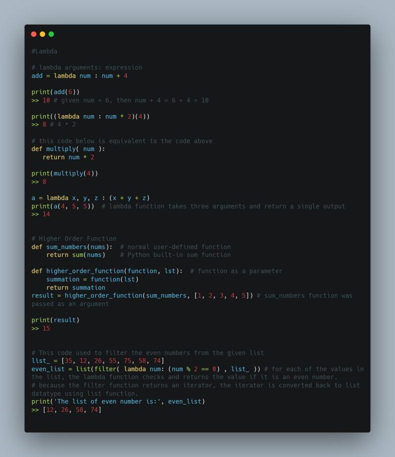

## Day 9: Anonymous Function, Higher Order Functions and Modules

Lambda function in python is an anonymous or unnamed function that accepts inputs of variable length but only return one output.

Higher order functions are functions that takes other functions as parameters or returns functions as a return value examples of built-in higher order functions includes: map, filter, reduce. They take other functions and iterables as arguments.

A module is a file containing definition of functions, classes, variables, constants or any other Python object. Contents of this file can be made available to any other program. The “import” keyword is used to load module into a Python file. Like functions, modules can be divided into built-in and user-defined modules.
Some examples of built-in modules include: os, math, string, datetime, collections etc. User-defined modules are test file with .py extension containing one or more functions, variables, constants and classes created to solve specific problems.

#100DaysOfDataEngineering  #DataEngineering  #Data

