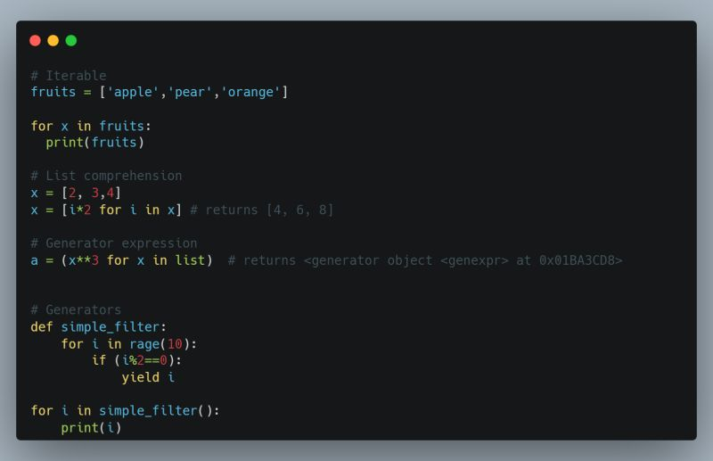

## Day 10: Iterators, List Comprehension, and Generators
⚫ Iterable is any Python object which can be iterated over. Examples of iterables include lists, sets, tuples, dictionaries, strings, etc.

⚫ Iterator is an object that allows you to iterate over collections of data, such as lists, tuples, dictionaries, and sets.

⚫ A Python object is considered an iterator when it implements two special methods “.__iter__()” and “.__next__()” known as the iterator protocol. Operations like for loop, comprehension etc. all work using iteration.

⚫ List comprehension is an easier way of defining and creating a list based on existing iterables. It is enclosed by a square bracket, from the left we have the output expression, for loop, an iterable or input sequence, and optional predicate. We also have set and dictionary comprehension.

⚫ Generators is a special type of function which does not return a single value, rather it returns an iterator object with a sequence of values. Unlike normal function, “yield” keyword is used in a generator function. An evaluation strategy whereby certain objects are only produced when required.

⚫ Generator Expressions are also an anonymous functions. They are implemented similar to a list comprehension, their difference are as follows: they use round parentheses instead of square parentheses; list comprehension returns a list, generator expression returns a generator object.

#100DaysOfDataEngineering #DataEngineering #Data

