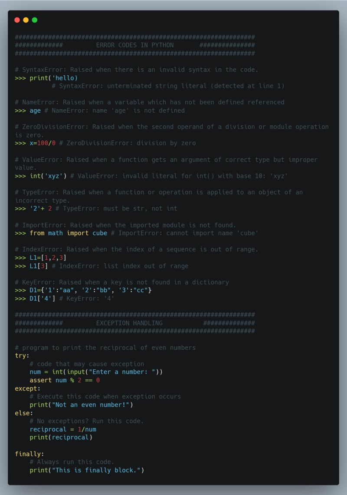

## Day 11: Exception Handling
Exception handling defined by Alexander S. Gillis, is the process of responding to unwanted or unexpected events when a computer program runs. Exception handling deals with these events to avoid the program or system crashing, and without this process, exceptions would disrupt the normal operation of a program.

Today I learnt about code errors, some of the common errors in Python includes: SyntaxError; NameError; ZeroDivisionError; ValueError; TypeError; ImportError; IndexError.

How to handle exceptions using “try and except” code blocks.

#100DaysOfDataEngineering #DataEngineering #Data

