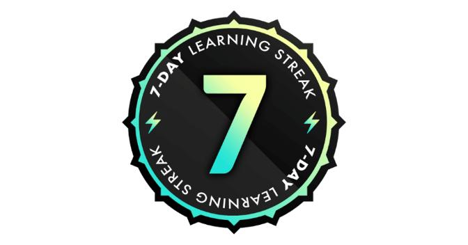

## Day 12: End of the Maven Analytics Open Campus Week

The past seven days have been nothing but interesting, it was the Maven Analytics 7 days Open Campus Week, granting data enthusiast 100% access to their online courses. Everyday for the past seven days I spent a good amount of time on their platform, learning and improving my knowledge. During this period I focused on MySQL learning path one of the flavors of SQL since SQL is an essential skill for all data related fields e.g. Data Engineering.

The courses were great, a good place to start for anyone looking to kickstart a career in data analysis or database administration. The course contents were well-structured, starting from basic concepts (fundamentals of SQL, writing simple query statements) to advance concepts (designing database schema, writing advance query statements and database management) using MySQL. John Pauler did a great job in breaking down complex concepts into digestible pieces, making it easy for beginners to grasp.

One of the standout features of these courses and many other courses on Maven Analytics platform is their hands-on learning practices, they mimic real-life scenarios and provide practical exercises after explaining each concept giving students the opportunity to apply what they've learnt.

Thanks to the [Maven Analytics](https://www.linkedin.com/company/maven-analytics/?lipi=urn%3Ali%3Apage%3Ad_flagship3_profile_view_base_recent_activity_content_view%3BPwSyTx4eRkm0nYyHFq8k4Q%3D%3D) Team and Special thanks to an amazing instructor [John Pauler](https://www.linkedin.com/in/ACoAAADemhkBlvK_j88kB96pmN12-eCCRPbDiFw?lipi=urn%3Ali%3Apage%3Ad_flagship3_profile_view_base_recent_activity_content_view%3BPwSyTx4eRkm0nYyHFq8k4Q%3D%3D).

#100DaysOfDataEngineering #DataEngineering #Data

