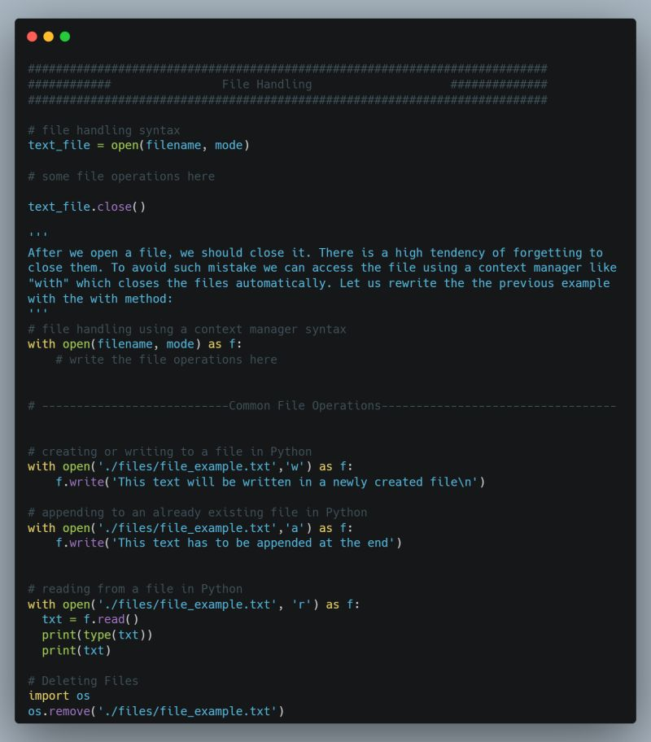

## Day 13: File Handling

File handling involves operations that can be performed on a file, it can involve creating a file, writing to a file, appending to a file and reading from an existing file.

The first step to working with files in Python is to open the file. You can open files using the open() function.
 
The open() function in Python accepts two arguments. The first one is the file name full path and the second one is the file open mode.
mode is used to specify the kind of operations to be performed on the file. Some of the common modes for files:
<ul>
<li>✒️ ‘r’ : This mode indicate that file will be open for reading only</li>
<li>✒️ ‘w’ : This mode indicate that file will be open for writing only. If file containing that name does not exist, it will create a new one</li>
<li>✒️ ‘a’ : This mode indicate that the output of that program will be append to the previous output of that file</li>
<li>✒️ ‘r+’ : This mode indicate that file will be open for both reading and writing</li>
</ul>

#100DaysOfDataEngineering #DataEngineering #Data

