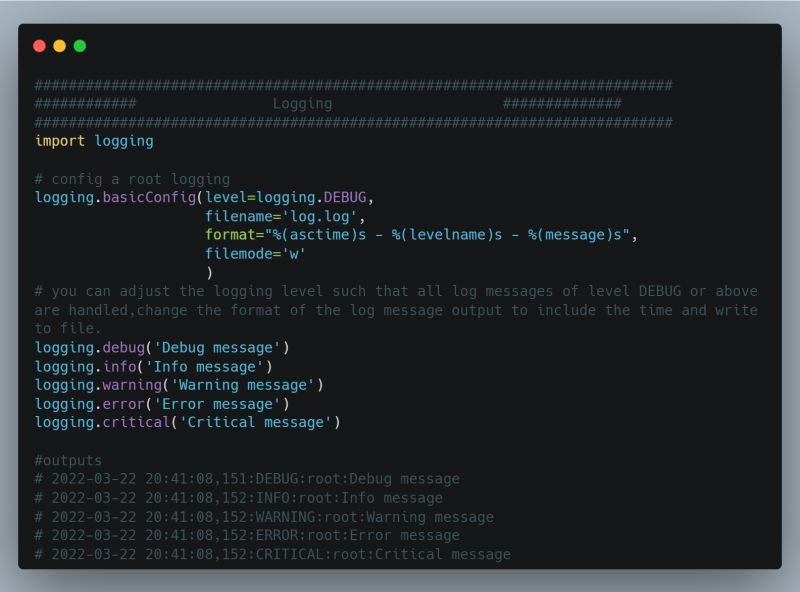

## Day 14: Logging in Python
Logging is a way to store information about your script and track events that occur. When you run an algorithm and want to confirm it is doing what you expected, it is natural to add some print() statements at strategic locations to show the program’s state. Printing can help debug simpler scripts, but as your code gets more and more complex, printing lacks the flexibility and robustness that logging has.

<ul>Benefits of Logging
<li>✔ More flexible and robust than the print statement,</li>
<li>✔ Better at code debugging</li>
<li>✔ Helps differentiate between severity between messages</li>
<li>✔ Write information to a file</li>
<li>✔ Increase and decrease the verbose of the logging messages without changing a lot of code.</li>
</ul>

The logging system in Python operates under a hierarchical namespace and different levels of severity. There are 5 different logging levels that indicate the severity of the logs, shown in increasing severity:
<ol>
<li>DEBUG</li>
<li>INFO</li>
<li>WARNING</li>
<li>ERROR</li>
<li>CRITICAL</li>
</ol>

#100DaysOfDataEngineering #DataEngineering #Data

