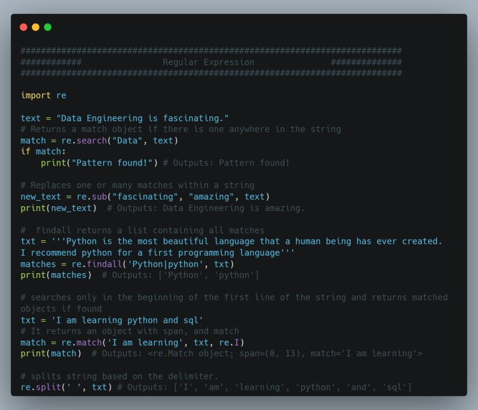

## Day 15: Regular Expression

A regular expression or RegEx is a powerful tool that helps to find patterns in data. A RegEx uses specialized syntax to match strings or set of strings. RegEx is imported using the re module.

<ul>
Common Methods in re Module:
  
<li>🔵 re.match: searches only in the beginning of the first line of the string and returns matched objects if found, else returns None.</li>
<li>🔵 re.search: Returns a match object if there is one anywhere in the string, including multiline strings.</li>
<li>🔵 re.findall: Returns a list containing all matches</li>
<li>🔵 re.split: Takes a string, splits it at the match points, returns a list</li>
<li>🔵 re.sub: Replaces one or many matches within a string</li>
</ul>

#100DaysOfDataEngineering #DataEngineering #Data

