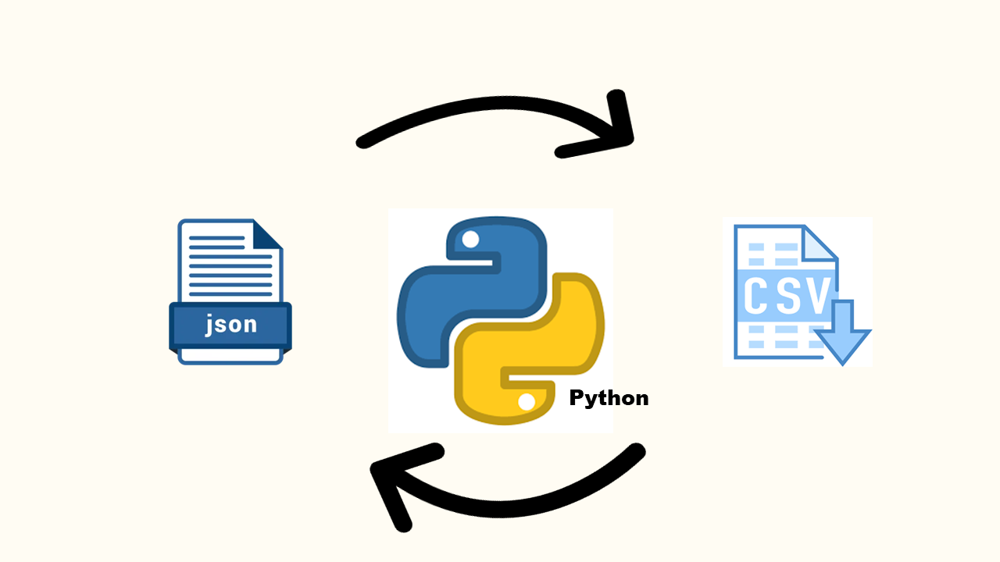
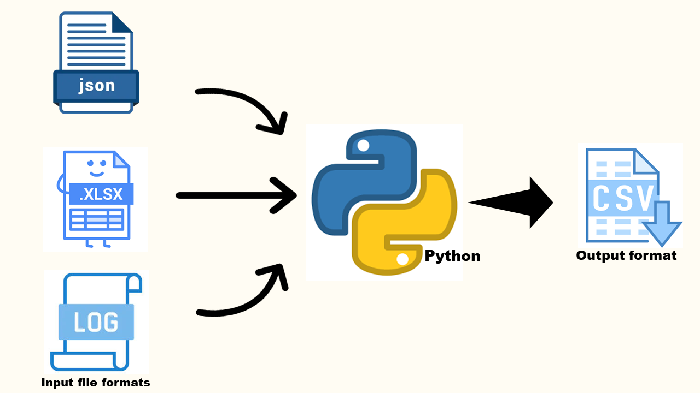

## Day 16 - 17: Reading file Task 
Using the python skills learnt over the past few weeks to read from different file format, convert files, write to file using custom python functions. 
* Read files from csv then convert to json format and vice versa
* Read files from xlsx with single sheet and convert to csv
* Read files from xlsx with multiple sheets and convert to multiple csv files.
* Read from .log files and save to csv. 

#100DaysOfDataEngineering #DataEngineering #Data

