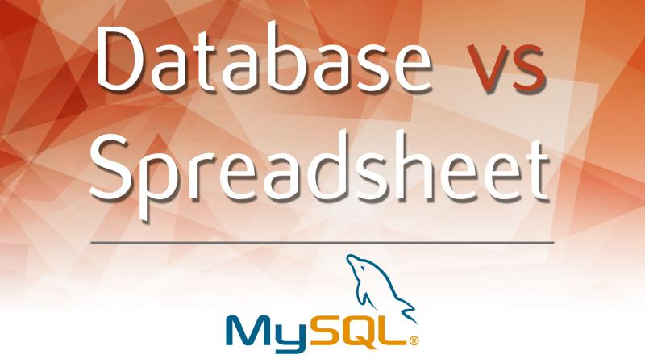

## Day 21: Database

<a href="https://www.google.com/url?sa=i&url=https%3A%2F%2Fwww.freepik.com%2Ffree-photos-vectors%2Fdatabase&psig=AOvVaw1K6NIVD0HWWHzHz4vdmITN&ust=1700502983849000&source=images&cd=vfe&opi=89978449&ved=2ahUKEwj7qM2z0dCCAxXnPEQIHa-9BDUQr4kDegUIARCBAQ" >Image gotten from Freepik</a>

***
\
Getting data from different sources is only but the beginning of the many functions a data engineer performs. After data is collected, they are stored in the database. 
Databases are used to store and manage large amounts of structured and unstructured data, and they can be used to support a wide range of activities, including data storage, data analysis, and data management. 
Today I learnt about relational database.
Relational databases are type of database that stores structured data in the form of tables, with rows representing records and columns representing fields. Relationships between tables can be established using keys. 
\
\
A relational database management system (RDBMS) is software that is used to create, manage, and maintain a database. It provides a way to store, organize, and retrieve data from the database. It provides an interface between the database and the users or applications that access it. 
\
\
SQL Statements are used for interacting with tables, columns and rows in relational databases. Common flavors of SQL include MySQL, PostgreSQL, Microsoft SQL Server.

**Relational Database are preferred over flat files and spreadsheets for the following reason:**
- ✅ Data Integrity: You can’t store data of different types in the same field.
- ✅ Faster Manipulation of Data: Setting up relations between tables increase the speed of data retrieval in a database over spreadsheets.
- ✅ Unlimited Volume of Data: Database can handle tables with millions of records unlike spreadsheets which is limited to about a million rows.
- ✅ Data Consistency: Normalization of data in the database, eliminates duplicate values, makes updating records easier. 
- ✅ Data Security: Access to the database can be controlled through permissions and user restrictions.

**
What is a database by Simplilearn: https://lnkd.in/gihiNDiz 
**
**
Database vs Spreadsheet by Martin Ganchev: https://lnkd.in/gBmpuq_U 
**

#100DaysOfDataEngineering #DataEngineering #Data
