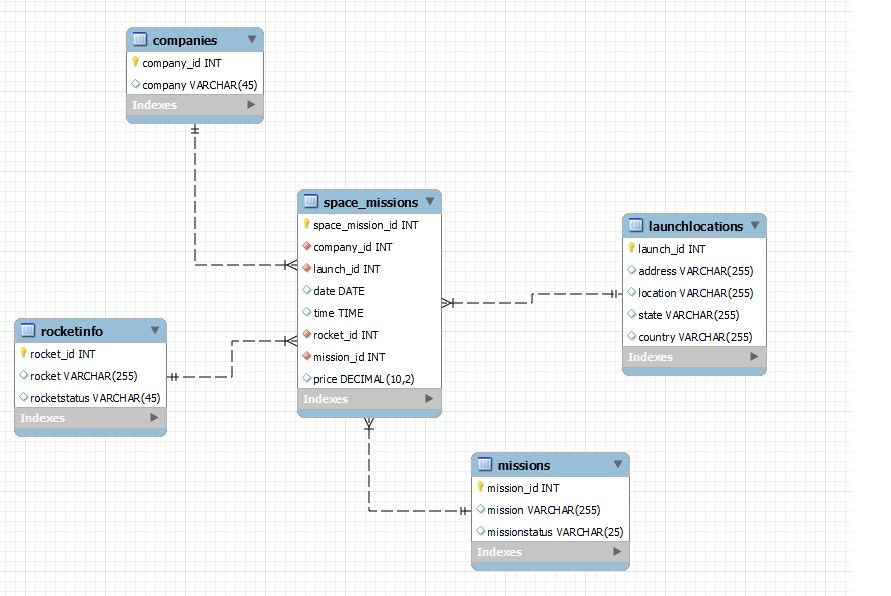
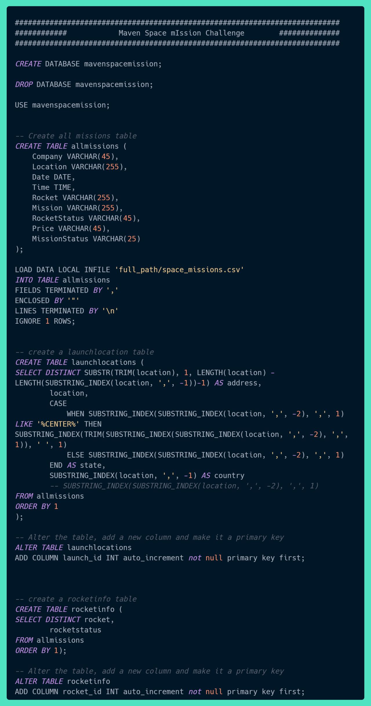
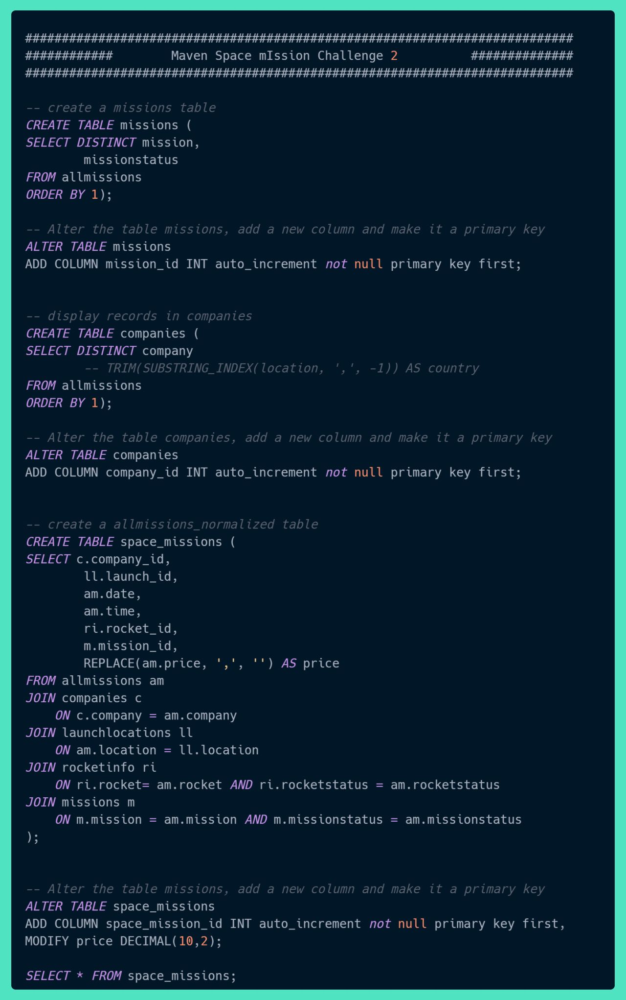

## Day 23: Creating and Working with a Database

After learning MySQL Database Administration on Maven Analytics, I was eager to practice my SQL skills in creating, populating, altering and deleting of databases and tables. I decided to practice with the Maven Space Mission Challenge dataset, which contains all the space missions in human history.

The dataset was in CSV format, with over 4,630 records. Each record contained information such as the mission name, location, date, launch status, company responsible, and rocket information.

📝 I started by creating a database called "mavenspacemission" and a table called "allmissions." I used the same number of columns as the CSV file, with an initial VARCHAR datatype for most of the columns except for dates and times.

📥 Tried to load the CSV file using the Data Import Wizard, but it was only able to load 2,970 records. I then decided to use the "Load Data" method, which was able to load the entire dataset.

❄ Did a sketch of the data model and relationship.

🌓 Used the SELECT statement to retrieve subsets of the records and created four more tables: locations, rocketinfo, company, and missions. I then created primary keys for each table and referenced them as foreign keys in the fact table.

🔗 To visualize the relationships between the tables, I generated an ER diagram from a script and then forward engineered the ER diagram to a script.

📤 Finally, I exported the dump structure and data to a SQL script and loaded the SQL script to create and populate all the tables.

**Some of the Problems encountered and solutions:**
<ol>
<li>Error Code: 1366. Incorrect DECIMAL value: '0' for column '' at row -1. Problem is strict sql mode is enabled, and you try to pass NULL or empty string as value for decimal fields, check link for solution: https://lnkd.in/gT4d8QtE</li>
<li>Error Code: 3948. Loading local data is disabled; this must be enabled on both the client and server sides. Problem: LOCAL_INFILE is disabled, check link for solution: https://lnkd.in/geNMRAdZ</li>
<li>Error Code: 2068. LOAD DATA LOCAL INFILE file request rejected due to restrictions on access. Problem: Access restriction, check link for solution: https://lnkd.in/g-i5P_rx</li>
</ol>

#100DaysOfDataEngineering #DataEngineering #Data

