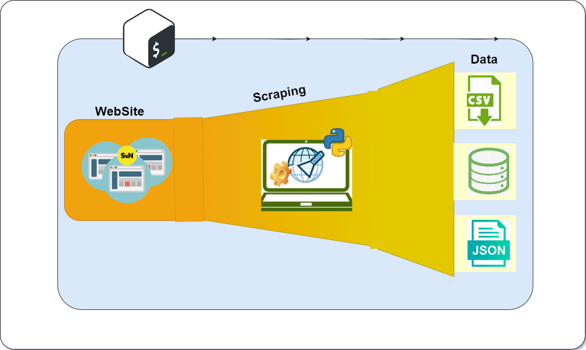

## Day 27: Learn Bash and SQL by creating bash script to automate Signal v. Noise web scraping task.

Created a Bash script to automate web scraping of the Signal v. Noise blog, combining Bash scripting with Python code. This task involves several steps: modularize python code for sending HTTP requests, parsing HTML content and extracting relevant data, and also python codes for storing it in desired formats; create a virtual environment and install required libraries; write a bash script that performs all the scraping and storage task.

#### Here's an in-depth breakdown of the steps involved:

**📑 Python Code Modularization:**
The existing Python code from Day 25, responsible for web scraping, data transformation, and data storage (CSV, JSON, SQLite, and MySQL), was modularized for integration into the Bash script.

**📦 Virtual Environment and Library Installation:**
Virtualenv library was used to create virtual environment, utilize pipreqs library to acquire a list of required Python libraries used in the Python scripts and saves them in a txt file. This step ensures that the necessary dependencies are available for the Bash script execution.

**📝 Bash Script Creation:**
Create a Bash script to accept database server arguments (such as login credentials, server location) as inputs. The Bash script manages the execution of Python scripts responsible for web scraping and subsequent data storage in multiple formats.
This Bash script acts as an orchestrator, invoking the modularized Python code with the provided database server information.

**Some of the knowledge acquired includes:**
✔ Learnt how to automate a task using bash script.
✔ Learnt how to work with variables in bash scripts
✔ Learnt how to parse argument to python using argparse library
✔ Learnt how to modify bash script using chmod
✔ Using pipreqs to retrieve only libraries used in the notebook.

#100DaysOfDataEngineering #DataEngineering #AnalyticsEngineering #Data #bashscripting 

