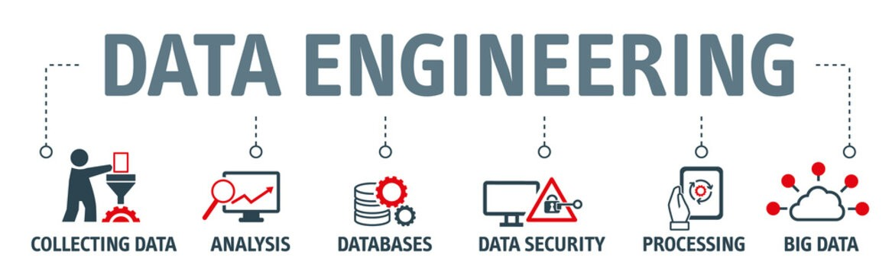

# Data Engineering Journey 

  
  
<a href="https://www.linkedin.com/pulse/tipoftoday139-free-data-engineering-learning-path-omar-najar/"> Image gotten from Omar's Daily Tips</a>

This repository is about my everyday journey in the data engineering field.

| # Day| Topics  | 
|:---:|:-------------|
| 01 | [Day 1: Why Data Engineering is important](https://github.com/Sylvesterchuks/Data_Engineering_Journey/tree/main/Day_01)  |
| 02 | [Day 2: Dynamic and Evolution of Data Engineering Work in an Organization.](https://github.com/Sylvesterchuks/Data_Engineering_Journey/tree/main/Day_02)  |
| 03 | [Day 3: Difference between a Data Engineer, Data Analyst and a Data Scientist.](https://github.com/Sylvesterchuks/Data_Engineering_Journey/tree/main/Day_03)  |
| 04 | [Day 4: Data Engineering Process](https://github.com/Sylvesterchuks/Data_Engineering_Journey/tree/main/Day_04)  |
| 05 | [Day 5: Some of the Skills used by Data Engineers.](https://github.com/Sylvesterchuks/Data_Engineering_Journey/tree/main/Day_05)  |
| 06 | [Day 6: Python Programming Basics](https://github.com/Sylvesterchuks/Data_Engineering_Journey/tree/main/Day_06)  |
| 07 | [Day 7: Python Programming Basics Continues](https://github.com/Sylvesterchuks/Data_Engineering_Journey/tree/main/Day_07)  |
| 08 | [Day 8: Recap on Python functions](https://github.com/Sylvesterchuks/Data_Engineering_Journey/tree/main/Day_08)  |
| 09 | [Day 9: Anonymous Function, Higher Order Functions and Modules](https://github.com/Sylvesterchuks/Data_Engineering_Journey/tree/main/Day_09)  |
| 10 | [Day 10: Iterators, List Comprehension, and Generators](https://github.com/Sylvesterchuks/Data_Engineering_Journey/tree/main/Day_10)  |
| 11 | [Day 11: Exception Handling](https://github.com/Sylvesterchuks/Data_Engineering_Journey/tree/main/Day_11)  |
| 12 | [Day 12: End of the Maven Analytics Open Campus Week](https://github.com/Sylvesterchuks/Data_Engineering_Journey/tree/main/Day_12)  |
| 13 | [Day 13: File Handling](https://github.com/Sylvesterchuks/Data_Engineering_Journey/tree/main/Day_13)  |
| 14 | [Day 14: Logging in Python](https://github.com/Sylvesterchuks/Data_Engineering_Journey/tree/main/Day_14)  |
| 15 | [Day 15: Regular Expression](https://github.com/Sylvesterchuks/Data_Engineering_Journey/tree/main/Day_15)  |
| 16-17 | [Day 16 - 17: Reading file Task](https://github.com/Sylvesterchuks/Data_Engineering_Journey/tree/main/Day_16_17)  |
| 18 | [Day 18: Types of Data and Data Sources](https://github.com/Sylvesterchuks/Data_Engineering_Journey/tree/main/Day_18)|
| 19 | [Day 19: Data Ingestion with Pandas](https://github.com/Sylvesterchuks/Data_Engineering_Journey/tree/main/Day_19)|
| 20 | [Day 20: Web Scraping/Extraction](https://github.com/Sylvesterchuks/Data_Engineering_Journey/tree/main/Day_20)|
| 21 | [Day 21: Working with Database](https://github.com/Sylvesterchuks/Data_Engineering_Journey/tree/main/Day_21)|
| 22 | [Day 22: SQL Basics, Query Structure, Built In Clause](https://github.com/Sylvesterchuks/Data_Engineering_Journey/tree/main/Day_22)|
| 23 | [Day 23: Creating and Working with a Database](https://github.com/Sylvesterchuks/Data_Engineering_Journey/tree/main/Day_23)|
| 24 | [Day 24: Database Design](https://github.com/Sylvesterchuks/Data_Engineering_Journey/tree/main/Day_24)|
| 25 | [Day 25:  Exploring Signal v. Noise Blogs: A Web Scraping Journey](https://github.com/Sylvesterchuks/Data_Engineering_Journey/tree/main/Day_25)|
| 26 | [Day 26: Bash Scripting](https://github.com/Sylvesterchuks/Data_Engineering_Journey/tree/main/Day_26)|
| 27 | [Day 27: Learn Bash and SQL by creating bash script to automate Signal v. Noise web scraping task.](https://github.com/Sylvesterchuks/Data_Engineering_Journey/tree/main/Day_27)|
| 28 | [Day 28: Frequently used Linux Commands in Data engineering.](https://github.com/Sylvesterchuks/Data_Engineering_Journey/tree/main/Day_28)|
| 29 | [Day 29: Working with PostgreSQL](https://github.com/Sylvesterchuks/Data_Engineering_Journey/tree/main/Day_29)|
| 30 | [Day 30: Building Robust Data Pipelines for Washington DC Service Calls Request: End to End Data Engineering Project](https://github.com/Sylvesterchuks/Data_Engineering_Journey/tree/main/Day_30)|
| 31-37 | [Day 31-37: Working with APIs: ETL Automation of World's Daily Weather Data Report Info](https://github.com/Sylvesterchuks/Data_Engineering_Journey/tree/main/Day_31-37)|
